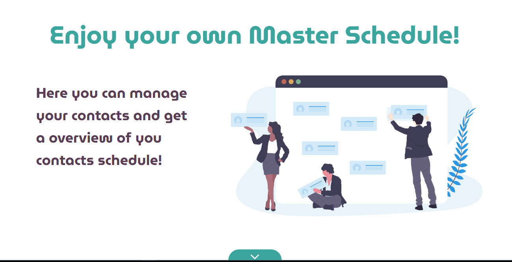

<h1 align="center" >
Contact Schedule!
</h1>

<strong>
React js application to manage contacts!
</strong>

This frontend was made with the backend struct in Java Spring Boot. See the repository <a href="https://github.com/mycatdoitbetter/schedule-backend">here!</a>

  <a aria-label="React Version" href="https://github.com/facebook/react/blob/master/CHANGELOG.md#16120-november-14-2019">
    </img>
  </a>
  <a aria-label="React Version" href="https://www.typescriptlang.org">
    </img>
  </a>

